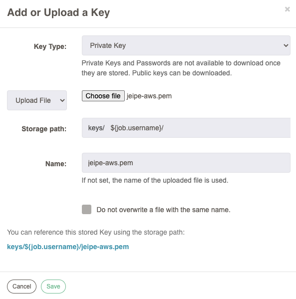

# Rundeck Playground

## Issue #1: Getting Rundeck docker up and running with SSL

### Option 1: Extending Rundeck Offical Image

This is kind of straight forward. 

In this directory you have the necessary files

```bash
.
├── Dockerfile
├── KeySetup.png
├── ReadMe.md
├── docker-compose.yaml
└── lib
    └── generate-ssl.sh

```

- Change rundeck version if necessary
- Change URL endpoint from `https://test:4443` to anything comfortable.
- Build using `docker-compose build` to build the image
- Run using `docker-compose up` to run the container

### Option 2: Rundeck Image from Scratch

An authentic source for it is found here which is tried and tested:

https://github.com/john77eipe/rundeck

Few advantages in this image are:

1. Based on debian:stretch
2. Layered with Supervisor, MariaDB, and Rundeck
3. It can take anywhere from 30 seconds to a few minutes for Rundeck to start depending on the available resources for the container (and host VM).
4. No SSH. Use docker exec or [nsenter](https://github.com/jpetazzo/nsenter)
5. If RUNDECK_PASSWORD is not supplied, it will be randomly generated and shown via stdout.
6. Supply the EXTERNAL_SERVER_URL or it will default to [https://0.0.0.0:4443](https://0.0.0.0:4443/)
7. As always, update passwords for pre-installed accounts
8. I sometimes get connection reset by peer errors when building the Docker image from the Rundeck download URL. Trying again usually works.


## Issue #2: SSH configuration of nodes 

Acceptability Criteria:
- to be able to manually ssh from within the container->nodes
- to be able to automatically manage the nodes using rundeck

### Direct (Usual) Approach

1. Generate SSH key pair in rundeck container
`ssh-keygen -t rsa`
Use the –t option to specify the type of key to create. 
Possible values are “rsa1” for protocol version 1, and “dsa“, “ecdsa“, or “rsa” for protocol version 2.

Your identification has been saved in /root/.ssh/id_rsa.
Your public key has been saved in /root/.ssh/id_rsa.pub.

The ssh-key command in the example generated two keys in the ~/.ssh directory:
```
$ ls ~/.ssh
id_rsa
id_rsa.pub
```

2. Place publick key on the remote node
copy the public key (~/.ssh/id_rsa.pub in this example) to ~/.ssh/authorized_keys on the remote system.

3. Disable password authentication on remote node (Optional)
You can improve system security even further by disabling the standard password authentication, and enforcing the key-based authentication. To do so, set the PasswordAuthentication option to no in the /etc/ssh/sshd_config configuration file as follows:
```
# vi /etc/ssh/sshd_config
PasswordAuthentication no
```

4. Change configuraiton in resources.xml 

In the rundeck container, navigate to the location of your project's configuraiton
Usually it is `/home/rundeck/projects/[projectname]/etc/resources.xml`

Modify or add entry:
`<node name="AWSRemote" description="Remote node" tags="" hostname="13.127.103.103" osArch="amd64" osFamily="unix" osName="Linux" osVersion="" username="ec2-user" ssh-keypath="/home/rundeck/.ssh/id_rsa" />`

The default and typical usage is to use a private key stored on the local file system specified via the ssh-keypath attribute.

### Key Storage Approach

For Cloud VMs, PEM files can be managed globally and used.

- Configure user level keys

  

- Use `ssh-key-storage-path` instead of `ssh-keypath`

- The value of the `ssh-key-storage-path` attribute can embed values taken from the execution context of the Rundeck job or execution, for example the username of the user running the job. This would be embedded as `${job.username}`, so to specify use of a key named "jeipe.pem" stored in a path with the username of the executing user, the attribute might be set as:
`ssh-key-storage-path="/keys/users/${job.username}/jeipe.pem"`
When resolved, this will evaluate to /keys/users/bob/jeipe.pem (for example).

But it didn't work for me but not using a custom storage path worked!!!

Leaving the custom storage path will cause the soft pointer be set as `keys/jeipe-aws.pem`

Updating this value in resources.xml got it working.


## Issue #3: Project is missing 

Even after creating a project from UI it might be mssing on your local file system `/home/rundeck/projects/`

I had to go to Project Settings -> Edit Nodes -> Configure Nodes -> Add Source -> File, and then fill in:
	Format: resourcexml
	File Path: /var/rundeck/projects/<proj_name>/etc/resources.xml
	Generate: Yes
	Include Server Node: Yes/No
	Require File Exists: Yes

Then the resources.xml was created.

It seems there is no longer a requirement to nest it under /var/rundeck/projects/<proj_name>/etc.
https://github.com/rundeck/rundeck/issues/3185

## Issue #4: Installing Software

To install any software like vim, you need the sudoer rights.
`rundeck` user is a password less user without sudoer permissions. 
So to install any software exec into the container as root.
`docker container exec -it --user root rundeck-ssl bash`
then 
`apt-get update`
`apt-get install vim`